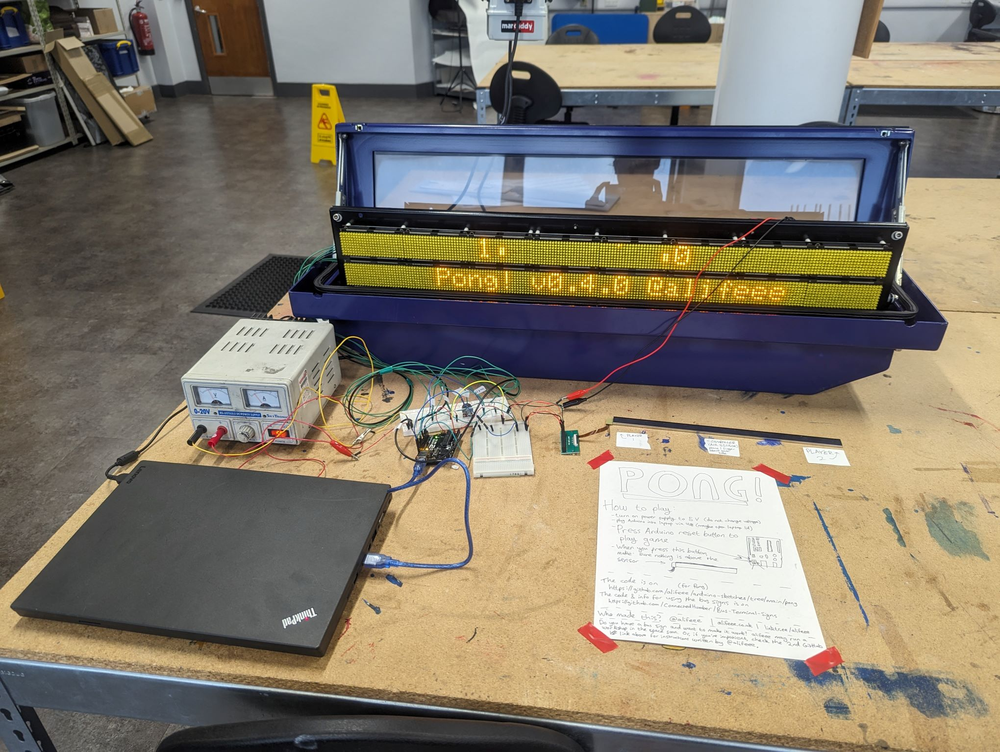
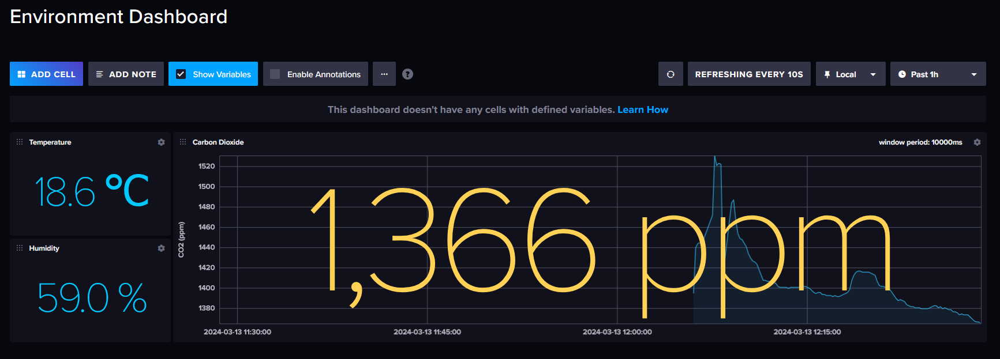
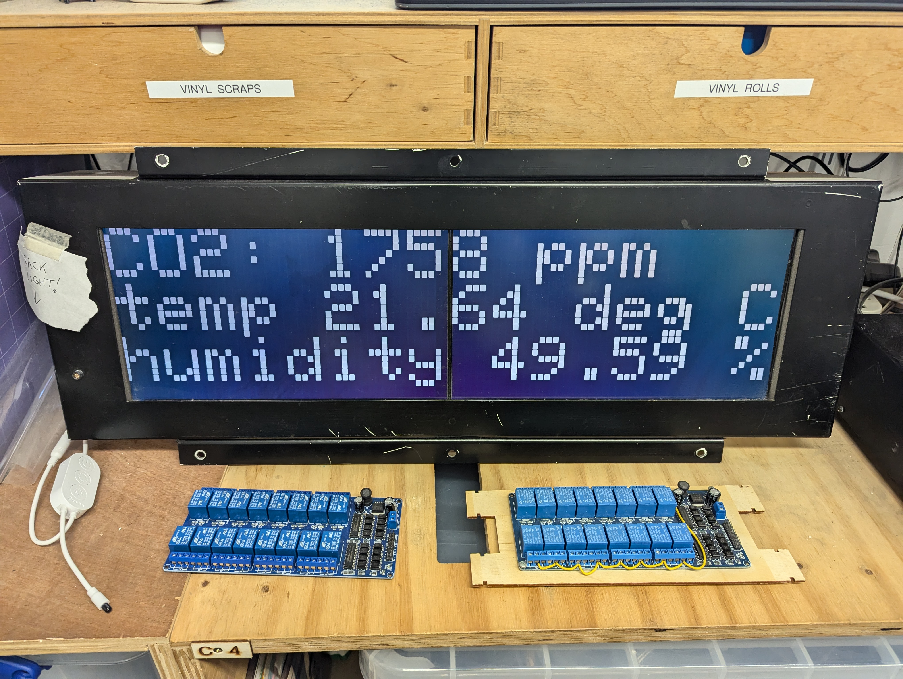

This is very much a favourite "thing", in that it is a favourite "concept".

I enjoy hardware hacking a bunch, mainly meaning programming microcontrollers. All my screwing around so far has been with C or C++ (or the "Arduino" language, which is basically just C).

I've:

screwed around with Arduino and hardware
: <https://github.com/alifeee/arduino-sketches>
: <https://github.com/alifeee/neonode-touch>

screwed around with web requests
: <https://github.com/alifeee/discord-webhooks-from-esp8266>

screwed around with old transport signs
: <https://blog.alifeee.co.uk/hull-bus-sign/>
: <https://github.com/ConnectedHumber/Bus-Terminal-Signs>
: <https://github.com/sheffieldhackspace/train-signs>
: <https://github.com/alifeee/openbenches-train-sign>
: 

screwed around with CO2 monitors
: <https://github.com/alifeee/CO2-monitoring>
: 

both!
: <https://github.com/sheffieldhackspace/co2-train-sign>
: 
