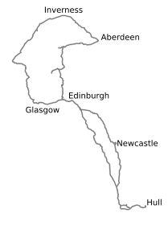
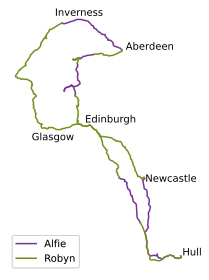

# Scotland Trip

GPX data from a wild camping trip to Scotland.

Mainly, generation of this image:

See the [Python notebook](./routes.ipynb).

## Tools used

- <https://www.google.com/maps/> for routes
- <https://mapstogpx.com/> for Google → GPX conversion
- <https://gpx.studio/> for GPX visualisation and combining

## Other image

