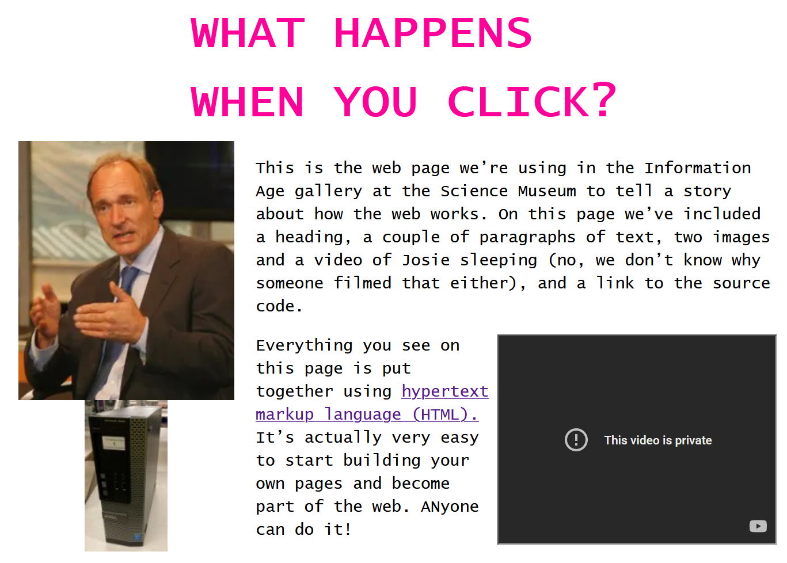

# When You Click

## What is this?

[`index.html`](./index.html) is the source code of an exhibit at the [British Science Museum](https://www.sciencemuseum.org.uk/). It is formatted... interestingly. This site is copied from [an image taken](./code_picture.jpg) while there.

The images didn't come with it, so I found my own (by googling `"Tim Berners Lee imagesize:250x200"` and `"computer imagesize:96x175"`).

View the site on <https://alifeee.co.uk/whenyouclick>

